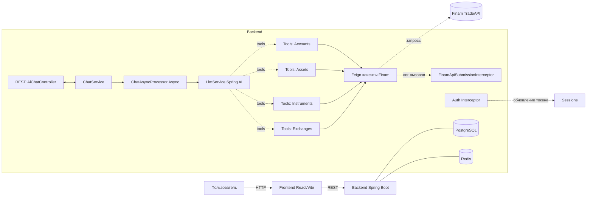

# Vibe Trader — AI‑ассистент для Finam TradeAPI

Vibe Trader — это экспериментальный AI‑агент, который переводит естественные запросы пользователя в корректные вызовы Finam TradeAPI. Вместо ручного похода по справочникам и формам — один диалог с ассистентом, который достаёт рыночные данные, анализирует их и умеет формировать торговые операции (с акцентом на безопасность и явность параметров).

Проект создан как прототип для хакатона и заточен под два ключевых сценария:
- интерактивный чат: «Покажи свечи SBER M5 за неделю», «Какая последняя котировка GAZP?»;
- пакетное мэппирование: CSV с вопросами → финальные HTTP‑запросы к Finam API (submission.csv для скоринга/лидерборда).


## Зачем и как это работает

- Единственный источник рыночных данных — Finam TradeAPI.
- Понимание запроса делает LLM через Spring AI. Встроенные tool’ы инкапсулируют доступ к эндпоинтам Finam API (через OpenFeign).
- Для пакетного режима агент получает CSV вида `uid;question`, последовательно вызывает подходящий tool и автоматически записывает фактический HTTP‑запрос в submissions (для последующей выгрузки в CSV).
- Безопасность-by-design: шаблоны промптов требуют явной передачи всех параметров для торговых действий. Агент не «додумывает» критичные значения.


## Ключевые возможности

- Диалог с ассистентом для рыночных вопросов и простых торговых операций.
- Получение OHLCV‑свечей, котировок, последних сделок, расписаний, параметров инструментов, списка бирж и т. п.
- Пакетный режим (мэппинг): загрузка CSV `uid;question` → генерация submission CSV с точными вызовами API.
- Хранение истории диалогов и задач (PostgreSQL), кеш/память чата (Redis).
- Автоматическая аутентификация в Finam (получение токена по секрету, авто‑обновление перед истечением).
- Postman‑коллекция для ручной отладки (папка finam-trade-api-postman).


## Архитектура (высокоуровнево)



Основные модули:
- Backend: Java 21, Spring Boot 3, OpenFeign, Spring AI; асинхронная обработка задач; перехват запросов для ведения «submission».
- UI: React + Vite (базовый чатовый интерфейс, в разработке).
- Хранилища: PostgreSQL (диалоги/сообщения/таски/промпты/сабмишены), Redis (кеш/память).


## Интеграция с Finam TradeAPI

Доступ инкапсулирован в tool‑классы, помеченные аннотацией `@Tool` (Spring AI):
- AccountsServiceTools — идентификатор счёта, выставление/отмена ордеров, статусы ордеров, список активных ордеров.
- AssetsServiceTools — описание инструментов, параметры, опционные цепочки, расписания, время сервера.
- InstrumentsServiceTools — исторические бары (timeframe), последняя котировка, последние сделки.
- ExchangesServiceTools — список бирж (MIC коды).

Важно: некоторые эндпоинты Finam для демо‑счёта недоступны (trades/transactions помечены @Deprecated в клиенте и не используются).


## Пакетный режим (CSV → submission.csv)

- Загрузите CSV файлом в чат эндпоинтом ниже. Ожидаемый заголовок: `uid;question` (разделитель — `;`).
- Для каждой строки агент формирует РОВНО ОДИН финальный tool‑вызов. Все фактические HTTP‑запросы к Finam API автоматически протоколируются и сохраняются.
- Когда задача завершена (DONE), погрузите сводный CSV с колонками: `uid,type,request`.

Пример CSV:
```
uid;question
001;Покажи свечи SBER M5 за последнюю неделю
002;Какая последняя котировка GAZP?
```

Что попадёт в submissions CSV:
- uid — ваш идентификатор из входного CSV;
- type — HTTP‑метод (GET/POST/DELETE…);
- request — путь и query (без хоста), например: `/v1/instruments/SBER/bars?interval.start_time=...&interval.end_time=...&timeframe=TIME_FRAME_M5`.


## REST API (Backend)

Базовый URL по умолчанию: http://localhost:8087 (в Docker Compose) или http://localhost:8080 (при локальном запуске backend без контейнера).

- GET /api/ai/dialogs — список диалогов.
- POST /api/ai/dialogs — создать диалог.
  - Тело: `{ "title": "Мой диалог" }`
- GET /api/ai/dialogs/{dialogId}/messages — сообщения диалога.
- POST /api/ai/dialogs/{dialogId}/messages (multipart/form-data) — отправить сообщение и опционально CSV.
  - Части формы:
    - data: JSON `{ "content": "текст запроса" }`
    - file: (опционально) CSV файл формата `uid;question`
- GET /api/ai/tasks/{taskId} — статус асинхронной задачи (RUNNING | DONE | ERROR).
- GET /api/ai/tasks/{taskId}/submission — скачать CSV с сабмишенами (доступен, когда задача DONE).

Пример отправки сообщения с файлом через curl:
```
curl -X POST "http://localhost:8087/api/ai/dialogs/1/messages" \
  -H "Accept: application/json" \
  -F "data={\"content\":\"\"};type=application/json" \
  -F "file=@questions.csv;type=text/csv"
```

Пример без файла (только текст):
```
curl -X POST "http://localhost:8087/api/ai/dialogs/1/messages" \
  -H "Accept: application/json" \
  -F "data={\"content\":\"Покажи свечи SBER D за месяц\"};type=application/json"
```


## Установка и запуск

1) Подготовьте переменные окружения
- Создайте .env на основе .env.example в корне проекта и заполните значения:
  - OPENAI_API_KEY — ключ для LLM (Spring AI/OpenAI);
  - FINAM_API_SECRET — секрет Finam для получения токена сессии.

2) Запуск через Docker Compose (рекомендуется для быстрого старта)
```
docker-compose up --build
```
Что поднимется:
- Backend (порт 8087 → 8080 внутри контейнера)
- PostgreSQL (порт 25437 → 5432)
- Redis (порт 26380 → 6379, пароль: redisadmin)
- pgAdmin (порт 5055; логин: kuramshin.py@yandex.ru, пароль: admin)

3) Локальный запуск без Docker
- Backend:
  - Требуется Java 21.
  - В одном терминале поднимите БД и Redis (например, через Docker) или используйте существующие.
  - Установите переменные окружения:
    - FINAM_API_SECRET
    - SPRING_AI_OPENAI_API_KEY (альтернатива OPENAI_API_KEY, если используете стандартные имена Spring AI)
    - PG_DATASOURCE_URL, REDIS_HOST, REDIS_PORT — при необходимости переопределения.
  - Запустите:
    ```
    ./gradlew :vibe-trader-backend:bootRun
    ```
- UI (Dev режим):
  ```
  cd vibe-trader-ui
  npm i
  npm run dev
  ```

Примечания конфигурации:
- finam-api.url, finam-api.secret можно задавать через application‑properties или переменные окружения; секрет обязателен.
- В docker-compose включён маппинг application-prod.properties в /app/config/application-prod.properties. При необходимости отредактируйте его под ваши параметры.


## Как агент мэппит запросы

- Системный промпт (см. PromptTemplates.SYSTEM_MAPPING) заставляет LLM для каждого `promptUid` выбирать и вызывать ровно ОДИН финальный tool.
- Каждый tool вызывает Feign‑клиент, а перехватчик FinamApiSubmissionInterceptor записывает метод/путь/квери реального запроса — это и есть «ground truth» для лидерборда.
- Для торговли требуются явные параметры (символ, количество, тип ордера и т. п.); без них агент не совершит действие.


## Postman коллекция

Для ручной отладки Finam API используйте коллекцию:
- `finam-trade-api-postman/REST API.postman_collection.json`


## Папка dataset

Папка `vibe-trader-backend/dataset` содержит примерные CSV (в т. ч. submission.csv) для локальной отладки мэппинга и демонстрации формата.


## Дальнейшие планы (roadmap)

- Расширить UI: интерактивные графики (свечи, стакан, портфель), подтверждения для ордеров, визуальные таблицы.
- Поддержать дополнительные сервисы Finam API (по мере доступности в демо/боевом режимах).
- Улучшить агентные сценарии: шаблоны диалогов для кейсов «портфельный аналитик», «рыночный сканер», «песочница стратегий».
